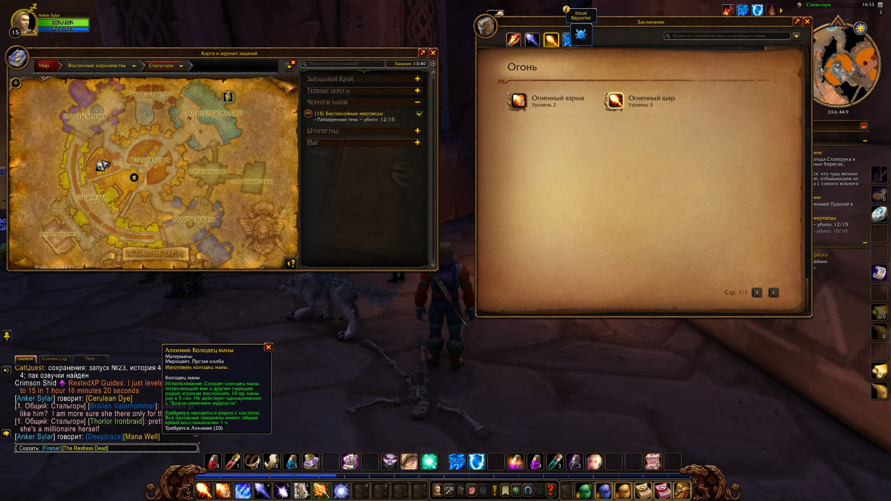

# EnglishLinks — WoW Forever


Аддон заменяет подписи игровых ссылок на английские в поле ввода чата.
ID, параметры, цвет и окружающий текст сохраняются. Отправку выполняет игрок.
Входящие сообщения, обычный текст, подсказки и интерфейс игры не переводятся.

Названия поставляются вместе с аддоном. Клиентский сбор полностью удалён:
не нужно переключать язык игры, запускать запросы или ждать загрузки заданий.



На скриншоте — английские ссылки предмета, способности и рецепта в чате;
Fireball и The Restless Dead — в поле ввода. Открытая подсказка Mana Well
показывает, что переведённая ссылка рецепта кликабельна. Нажми на изображение,
чтобы рассмотреть полный размер.

В 0.6.0 Wowhead Forever стал основным источником названий. При
расхождении выбирается Wowhead; остальные источники добавляют отсутствующие ID.
Добавлены бонусные окончания предметов и исправлена подпись метки карты.
Эти изменения проверены вне игры; новый формат окончаний ещё требует проверки
в клиенте. Работа английских ссылок рецептов подтверждена ранее в 0.5.0.

В 0.6.1 добавлены 2 039 значений случайного свойства `rand` (2 012 положительных
и 27 отрицательных ID, 46 вариантов окончаний) из Wowhead Forever.
Ссылки с `rand` и bonus ID поддерживаются совместно: одинаковое окончание
добавляется один раз, при конфликте сохраняется исходная подпись.

После выхода сборки 1.60.1.70170 источники проверены заново: добавлены
40 предметов, 44 заклинания, 81 задание и 23 ID случайных свойств.
Сейчас поддерживаются 2 062 значения `rand` и 53 варианта их названий.
Названия из прежнего снимка сохранены, если их нет в свежем списке.
Подробности: [проверка источников](docs/SOURCE-UPDATE-70170.md).

## Встроенные данные

| Данные | Количество | Приоритетный источник |
| --- | ---: | --- |
| Предметы | 24 102 | Wowhead Forever |
| Заклинания и способности | 31 839 | Wowhead Forever |
| Навыки, включая профессии | 154 | Wowhead Forever |
| Достижения и статистика | 434 | Wowhead Forever |
| Задания | 5 331 | 5 287 Wowhead + 44 из остальных источников |
| Валюты | 9 | Wowhead Forever |
| Виды питомцев-компаньонов | 113 | Wowhead Forever |
| Транспорт по ID заклинания призыва | 217 | Wowhead Forever |

Снимок Wowhead получен 2 октября 2026; точная сборка данных сайта не заявлена.
Общественные снимки сохранены как дополнительные источники.
Ручные названия пользователя по-прежнему имеют приоритет над встроенной базой.

Наличие записи в источнике не означает, что объект доступен игроку.
Отчёт сохранённого снимка: `data/wowhead-report.json`.

Для `worldmap` используется стандартная подпись `Map Pin Location`; значок,
UiMapID и координаты сохраняются. База названий карт больше не нужна.
Название рецепта берётся непосредственно по spell ID.

## Установка и обновление

Готовые установочные ZIP автоматически появляются в
[GitHub Releases](https://github.com/Anfalov/EnglishLinks/releases) после push в `main`, меняющего файлы `EnglishLinks/`.
Выбирай `EnglishLinks-<версия>.zip` в Assets. Нумерация и повторный запуск:
[автоматические выпуски](docs/RELEASES.md).

Скачать проект: **Code → Download ZIP** в [репозитории GitHub](https://github.com/Anfalov/EnglishLinks).
Из распакованного архива нужна вложенная папка `EnglishLinks`.

1. Закрой игру и замени папку `EnglishLinks` в `Interface/AddOns` клиента Forever.
   Замени папку целиком: в новой версии больше нет `Collection.lua`.
2. Итоговый путь: `Interface/AddOns/EnglishLinks/EnglishLinks.toc`.
3. Запусти игру с любым языком. Версия TOC — `16001`.
4. `/el status` показывает версию, `/el coverage` — заполненность баз.
5. Вставь ссылку через Shift+Click в открытое поле чата.

Настройки и ручные названия сохраняются. Старый `EnglishLinksDB.learned`
больше не читается и не пополняется; уже существующее содержимое оставлено
в SavedVariables для возможности восстановления. Новым установкам эта таблица
не создаётся. Путь настроек внутри каталога выбранного клиента:
`WTF/Account/<аккаунт>/SavedVariables/EnglishLinks.lua`.

В AddOns нужна только папка `EnglishLinks`. Python, исходные базы и другие
аддоны для работы не нужны.

## Команды

| Команда | Назначение |
| --- | --- |
| `/el on`, `/el off` | Включить или выключить обработку |
| `/el status` | Версия, язык и статистика |
| `/el coverage` | Количество названий только в подключённых непустых базах |
| `/el type spell off` | Отключить формат; `on` включает его |
| `/el missing` | До 1 000 неизвестных пар «тип:ID» |
| `/el set quest 7 Kobold Camp Cleanup` | Ручное английское название |
| `/el unset quest 7` | Удалить ручное название |
| `/el set 6948 Hearthstone` | Старый формат команды для предметов |

Команды `collect` и `export` удалены. `/el off` не отменяет уже сделанные
изменения черновика: для исходной подписи вставь ссылку заново.

Форматы для `/el type`: `item`, `spell`, `enchant`, `trade`, `quest`, `achievement`,
`currency`, `nonbattlepet`, `talent`, `worldmap`, `mount`.

Категории для `/el set`: `item`, `spell`, `profession`, `quest`, `achievement`,
`currency`, `companion`, `talent`, `mount`.

## Ограничения

- Категории без встроенных данных не выводятся в `/el coverage`.
- Поддерживаются 345 бонусов предметов с 50 английскими окончаниями.
  Дополнительно поддерживаются 2 062 знаковых ID случайного свойства `rand`.
  Неизвестные ID, некорректные поля и конфликтующие окончания сохраняют
  исходную подпись целиком. Пространства ID `rand` и bonus ID не смешиваются.
- Имена игроков, клички питомцев, неизвестные и украшенные разметкой подписи
  не переводятся (исключение — стандартный значок метки карты). При превышении лимита поля весь текст остаётся прежним.
- Питомцы-компаньоны: поддерживается подтверждённый в клиенте формат
  `nonbattlepet:speciesID`, категория базы — `companion` (113 имён).
  Например, `nonbattlepet:5005` → Musical Gustjumper. `battlepet` и
  `battlePetAbil` не обрабатываются: бои питомцев не входят в цель аддона.
  `/el type nonbattlepet off` отключает перевод, `on` включает.
  Старые ручные названия видов из категории battlepet переносятся в companion.
- Обработка журнала подземелий (`journal`), сборок талантов (`talentbuild`)
  и ссылок на привязки к подземельям/рейдам (`instancelock`) удалена.
  Такие ссылки остаются без изменений. Отдельные таланты и метки карты работают.
  Старые настройки, ручные названия и записи missing этих удалённых категорий
  очищаются при загрузке аддона.
- Доставка ссылок питомцев зависит от игры: наблюдалась проблема отправки
  исходных ссылок `nonbattlepet:`. Перевод имени не исправляет эту проблему.
- Совместимость со всеми сторонними интерфейсами чата не проверена.

## Обновление данных и выпуск

Разработка ведётся в **`develop`**. Готовые изменения переносятся в **`main`**.
Релиз создаётся при изменениях в папке `EnglishLinks/`; документация и исходные
снимки сами по себе новый выпуск не запускают.

Аддон загружает готовый `NameData.lua`. Отдельная автоматизация **Update addon
names** запускается кнопкой в GitHub Actions, а также по понедельникам и четвергам
в 09:00 по Екатеринбургу.
Она сравнивает свежие источники с текущей базой: Wowhead добавляет и исправляет
названия, остальные источники только добавляют отсутствующие ID. Недоступные
источники пропускаются. При изменениях — тесты, `autoupdate` → `main` и выпуск;
без изменений — только отчёт.

[Запуск и правила обновления](docs/AUTO-UPDATE.md) ·
[Устройство выпуска](docs/RELEASES.md) · [Правила разработки](AGENTS.md).

Локальная упаковка готового аддона, без скачивания и пересборки баз:

```sh
python tools/package_release.py
```

Результат — один установочный ZIP. Архивы источников и материалы CurseForge в него не входят.

## Проверка

```sh
python -m pip install lupa
python tests/run_tests.py
```

Проверяются Python-импортёры, Lua 5.1, ссылки и курсор, сохранение payload,
отсутствие запросов заданий, игнорирование старого learned, парсеры источников
и готовая база названий. Проверки вне игры не заменяют проверку в клиенте.

Происхождение и лицензии: `NOTICE`, `LICENSE`, `docs/QUEST-SOURCES.md`.

## Реестр источников для обновлений

Единый список адресов, версий/коммитов, дат и хешей: `data/source-registry.json`.
Читаемый перечень и порядок обновления после релиза: `docs/SOURCE-REGISTRY.md`
в полном архиве проекта. Неизвестное время старых скачиваний отмечено явно.
При каждом новом скачивании нужно дополнять реестр точным временем и сохранять
предыдущие снимки.
